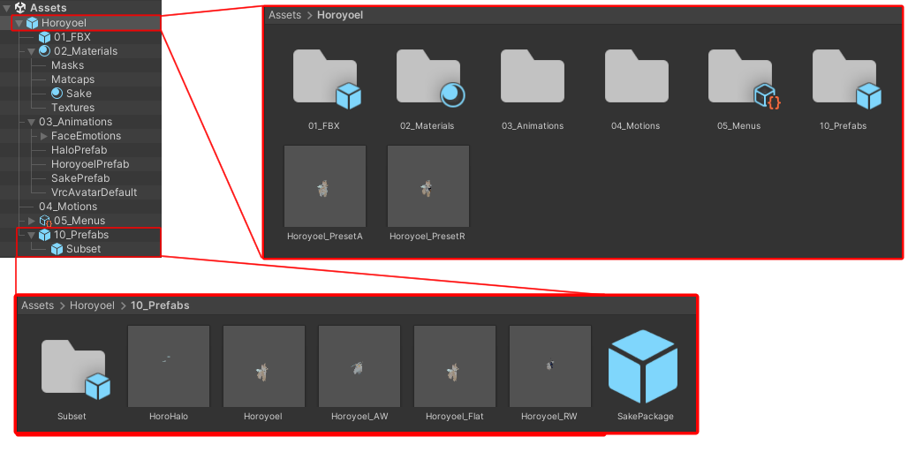
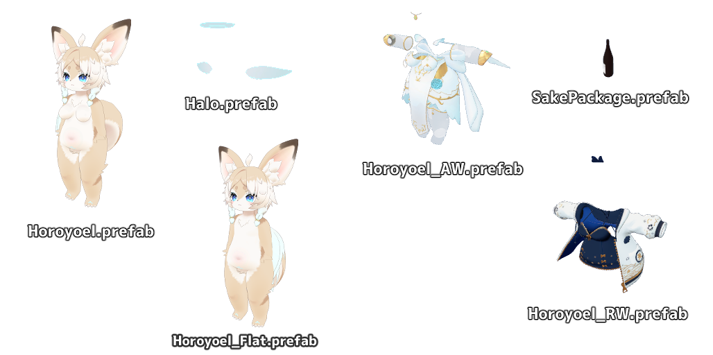
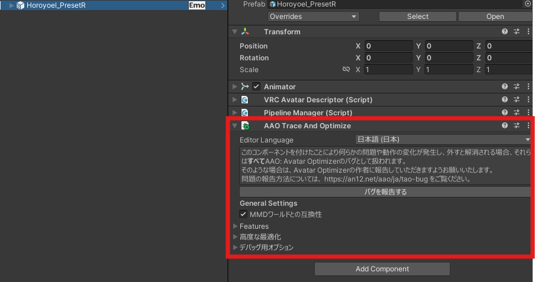
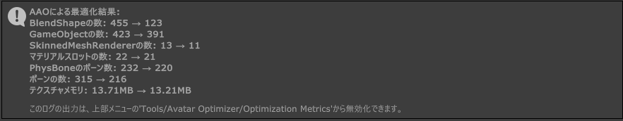
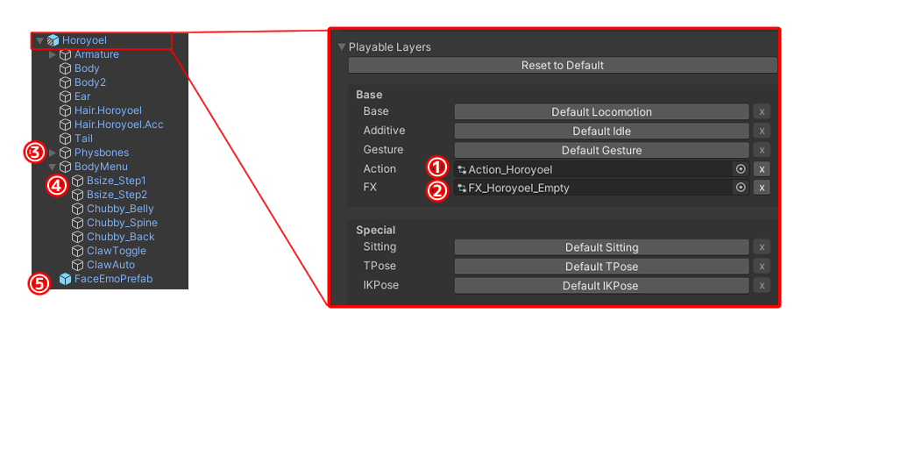

# Modification Guide

## Folder Structure

Below is the folder structure of `Assets/Horoyoel/`.  
The purpose of each folder is described in the right column.

| Folder Name     | Description                                                  |
| --------------- | ------------------------------------------------------------ |
| `Horoyoel`      | Contains configured presets. `Horoyoel_PresetA`: Horoyoel wearing the angel outfit `Horoyoel_PresetR`: Horoyoel wearing roomwear |
| `01_FBX`        | Contains the main model FBX files. These are the base files for all Prefabs. If you are not sure how to use them, do not modify them. |
| `02_Materials`  | Contains materials based on lilToon. Textures are also included here. |
| `03_Animations` | Contains Animator Controllers and animation files.           |
| `04_Motions`    | Contains AFK motions.                                        |
| `05_Menu`       | Contains menu assets for each Prefab.                        |
| `10_Prefabs`    | Contains individual Prefabs that make up Horoyoel. `HoroHalo`: Halo and angel wings. Add this to the Horoyoel base Prefab to complete setup. MA configured. `Horoyoel`: Horoyoel base body. Expressions configured. `Horoyoel_AW`: Angel outfit. Add this to the Horoyoel base Prefab to dress the avatar. MA configured. `Horoyoel_RW`: Roomwear. Add this to the Horoyoel base Prefab to dress the avatar. MA configured. `SakePackage`: Sake bottle. Add this to the Horoyoel base Prefab to complete setup. MA configured. |

---

## Preset Structure

Horoyoel uses the following Prefab structure.

All Prefabs except `Horoyoel.prefab` itself are Modular Avatar configured.  
You can implement them simply by dragging and dropping them onto the base body.

Use `Horoyoel.prefab` as the base for modifications.

---

### Optimization Tip

Because the outfits support Modular Avatar, each outfit contains a significant number of humanoid bones.  
As a result, the bone count after building may be high.

For example, by adding the [AAO Trace And Optimize component](https://vpm.anatawa12.com/avatar-optimizer/ja/) to `Horoyoel_PresetR`, the bone count can be reduced from 315 to 216.

---

## Prefab Structure and Component Roles

Below is the structure of `Horoyoel.prefab`.

| No.  | Component                                        | Description                                                  |
| ---- | ------------------------------------------------ | ------------------------------------------------------------ |
| (1)  | Action Layer in Horoyoel - VRC Avatar Descriptor | Only the AFK motion is replaced in the Action Layer.         |
| (2)  | FX Layer in Horoyoel - VRC Avatar Descriptor     | The FX Layer includes animation controls for chest size adjustment and claw toggling. If you want to directly specify body shape or claw visibility from the mesh, remove the FX Layer here. |
| (3)  | PhysBones                                        | Contains VRC PhysBone settings, Colliders, and auxiliary bone settings.  Removing this may break joint movement. |
| (4)  | BodyMenu                                         | Menu for chest size adjustment and claw settings. If you remove this, also remove the FX Layer described in (2). |
| (5)  | FaceEmoPrefab                                    | Contains animations for expression settings. You can remove expressions by deleting this. |

---

## Expression Modification Guide

Horoyoel’s expression control is built using the external package [FaceEmo](https://suzuryg.github.io/face-emo/) by Suzuryg.

This manual does not explain the full usage or setup procedure of FaceEmo itself.  
However, the following sections summarize common points that may cause issues during modification.

---

### Point 1: Restore the Menu

To restore the default menu and configure settings, follow the steps below to restore the menu from the backup file.

> Place the Horoyoel Prefab in the scene.
>
> From the Unity menu, select `FaceEmo/Restore Menu`.

Select:

`Assets/Suzuryg/FaceEmo/BackupFaceEmo_Horoyoel.asset`

If `FaceEmo_Horoyoel` is loaded into the scene, the restore was successful.

If the following error appears, rename the Prefab in the scene to `Horoyoel` and try again.  
If it still fails, refer to Point 2 and configure the references manually.

---

### Point 2: Set References for Animated Objects

If you want to animate PhysBone objects or Toggle objects together with expressions, you must set the target object references inside the FaceEmo settings.

If these references are missing, the following issues may occur:

- Tongue remains out and does not return
- Eye expressions do not switch
- Specific expressions do not respond

In FaceEmo’s expression settings screen, correctly assign the target GameObjects and PhysBone components.

> Check the Inspector of `FaceEmo_Horoyoel` and confirm that additional expression objects (Toggle) and additional expression objects (Transform) are configured as shown in the image.

---

### Point 3: Setting Expressions Without FaceEmo

If you want to create your own expression menu and Animator without using FaceEmo, you can replace the FaceEmo control simply by removing it from the Prefab.

> Delete `FaceEmoPrefab` inside `Horoyoel.prefab`.

This disables FaceEmo control and allows you to use your own expression control system.
