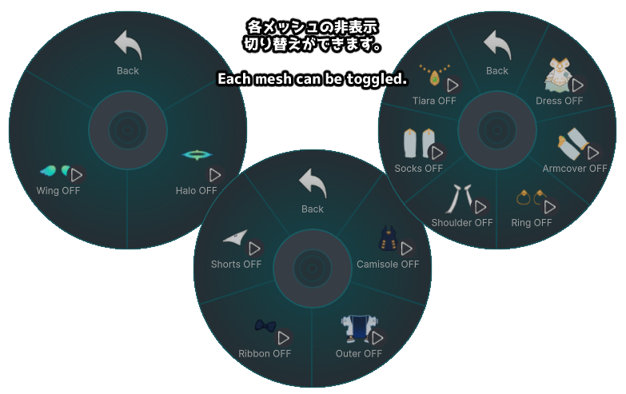
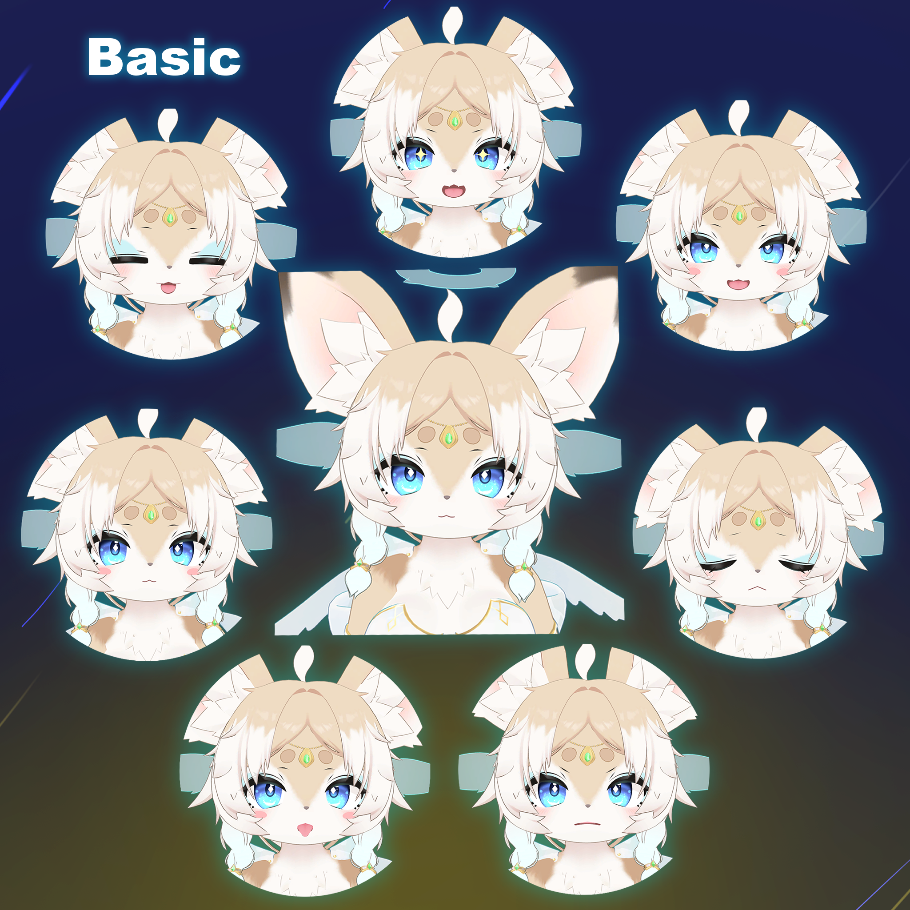
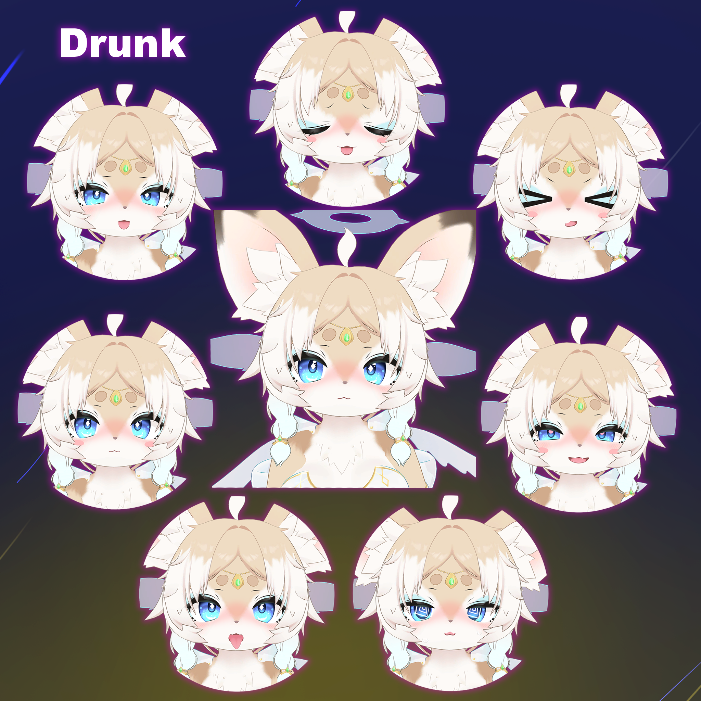
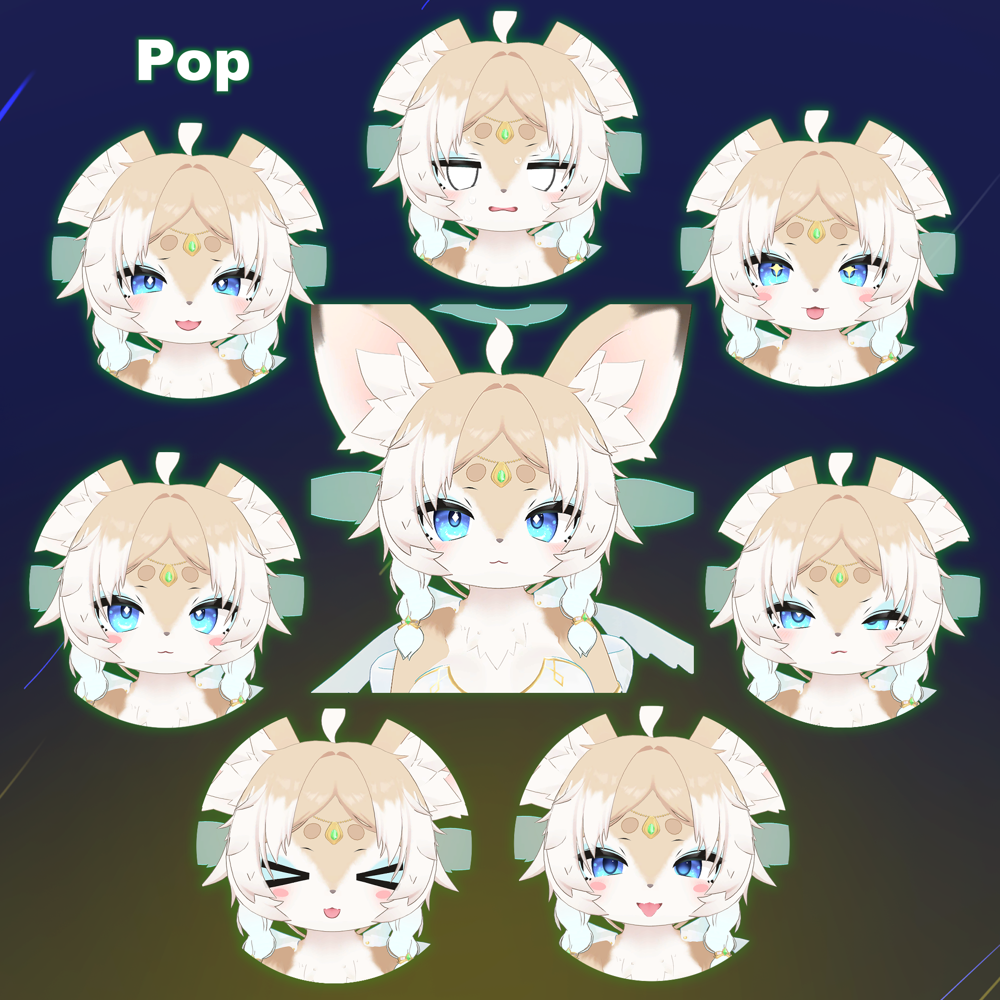
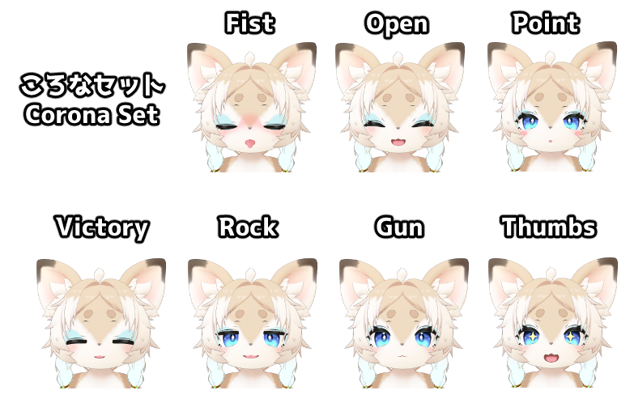

# Basic Usage

This section explains the main interactions, such as Horoyoel’s expressions and body gimmicks.

---

## Expression Menu

Horoyoel’s menu is structured as shown below.

---

## BodyMenu

BodyMenu includes the following options:

- **Bsize**: Adjusts chest size. Default is 45%.
- **ClawToggle**: Toggles claws on and off.
- **ClawAuto**: When enabled, you can toggle the claws without opening the menu by placing both hands in front of the face and performing the gesture sequence Fist → Open.

---

## SakeMenu

SakeMenu allows you to toggle the sake bottle on and off.

If the sake bottle is tilted beyond a certain angle, the contents will pour out.

---

## Halo Setting / Cloth Toggle Menu

---

## FaceEmo

FaceEmo allows you to select one of four expression sets.

|  |
| :----------------------------------------: |
|  |
|  |
|  |

---

## FaceEmo Usage

For basic FaceEmo usage, please refer to the official documentation:

👉 [FaceEmo Operation Guide / Setting Menu](https://suzuryg.github.io/face-emo/ja/docs/optional-functions/setting-menu/)

The dance gimmick is also explained on the page above.

Known issue:  
During the dance gimmick, the Breast Size option in the Body Adjust gimmick may not work correctly.  
If you want to use the dance gimmick while changing Breast Size, please refer to the Modification Guide and change the default body shape.
