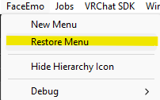
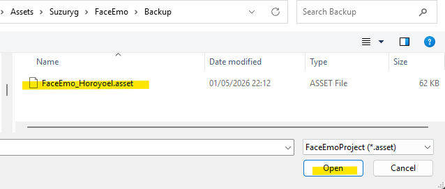
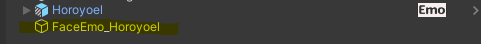
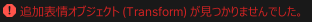
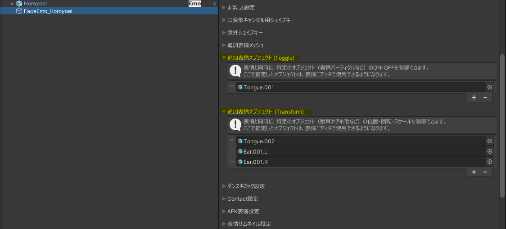

# 改変ガイド 

## フォルダ構成

以下は `Assets/Horoyoel/` のフォルダ構成です。  
それぞれの用途・目的を右欄に記載しています。

| フォルダ名      | 説明                                                         |
| --------------- | ------------------------------------------------------------ |
| `Horoyoel`      | **設定済みプリセット**が入っています。 Horoyoel_PresetA　 (天使の服のホロヨエル) Horoyoel_PresetR　(部屋着のホロヨエル) |
| `01_FBX`        | **モデルFBXファイル本体が入っています**。すべてのPrefabのベースとなります。 使用方法がわからない場合は変更しないでください。 |
| `02_Materials`  | **マテリアル格納フォルダ**。lilToonベースで構成されています。 **テクスチャ**もここに含まれています。 |
| `03_Animations` | **Animator ControllerとAnimationファイルが含まれます**。  |
| `04_Motions`    | AFKモーションが含まれます。                                  |
| `05_Menu`       | 各Prefab毎のメニュー群が含まれます。                         |
| `10_Prefabs`    | ホロヨエルを構成する個別のPrefabが含まれています。 HoroHalo：ヘイローと天使の翼。ホロヨエルの素体Prefabに入れることで設定完了。（MA設定済み） Horoyoel：ホロヨエルの素体。表情設定済み。 Horoyoel_AW：天使の服。ホロヨエルの素体Prefabに入れることで着せ替え完了。（MA設定済み） Horoyoel_RW：部屋着。ホロヨエルの素体Prefabに入れることで着せ替え完了。（MA設定済み） SakePackage：日本酒。ホロヨエルの素体Prefabに入れることで設定完了。（MA設定済み）  |

## プリセット構成

ホロヨエルは以下のようなPrefab構成になっています。
Horoyoel.prefab(素体)以外のPrefabはすべてMA設定済みで、素体にドラッグ＆ドロップするだけで実装できます。
改変のベースにはHoroyoel.prefabを使用してください。

💡軽量化Tip💡

MA対応のため、各衣装にヒューマノイドボーンが相当数含まれており、そのままではビルド後のボーン数が多くなっています。
例として、Horoyoel_PresetRにAAO Trace And Optimizeコンポーネント (https://vpm.anatawa12.com/avatar-optimizer/ja/)を追加することで、ボーンの数を315 -> 216まで削減できます。

---
### 🧱 Prefab構成と各コンポーネントの役割

以下は、Horoyoel.prefabの構成です。

| 番号 | コンポーネント                                  | 説明                                                         |
| ---- | ----------------------------------------------- | ------------------------------------------------------------ |
| (1)  | Horoyoel - VRC Avatar descriptor内のActionLayer | ActionレイヤーではAFKモーションのみ差し替えられています。  |
| (2)  | Horoyoel - VRC Avatar descriptor内のFXLayer     | FXレイヤーのアニメーションは胸のサイズ調整、爪の出し入れの制御が含まれています。 体型や爪の有無をメッシュから直接指定する場合はFXレイヤーをここから削除してください。 |
| (3)  | Physbones                                       | VRCPhysboneの設定、Collider、および補助ボーンの設定が含まれます。  削除すると関節部の動きが壊れる可能性があります。 |
| (4)  | BodyMenu                                        | 胸のサイズ調整、爪の出し入れ設定用のメニューです。削除する場合(2)のFXLayerも削除してください。 |
| (5)  | FaceEmoPrefab                                   | 表情設定用のアニメーションが含まれます。 これを削除することで表情を削除できます。 |
|      |                                                 |                                                              |

---

## 表情改変ガイド

ホロヨエルの表情制御は、Suzuryg氏による外部パッケージ [FaceEmo](https://suzuryg.github.io/face-emo/) を使用して構築されています。  
本マニュアルでは、**FaceEmo自体の使用方法や構築手順の詳細な解説は行いません**。  
ただし、改変時に特につまづきやすいポイントを以下にまとめます。

---

### ✅ ポイント1：メニューの復元

デフォルトのメニューを復元して設定を行うために以下の手順に従ってバックアップファイルからメニューを復元してください。

> PoyominaのPrefabをシーンに配置します。
>
> UnityのMenuから`FaceEmo/Restore Menu`を選択してください。
>

`\Assets\Suzuryg\FaceEmo\BackupFaceEmo_Horoyoel.asset`を選択してください

SceneにFaceEmo_Horoyoelがロードされれば成功です。

このようなエラーが表示された場合、Scene上のPrefabを"Horoyoel"にリネームして再度実行してみてください。それでも失敗する場合はポイント２を参考に設定をしてください。

****

---

### ✅ ポイント2：アニメーション対象オブジェクトの参照設定

**PhysBoneやToggleオブジェクトを表情と連動してアニメーションさせる場合**、FaceEmo設定内で **対象オブジェクトの参照設定** が必要です。  
これを忘れると以下のような不具合が発生する可能性があります：

- 舌が出たまま戻らない  
- 瞳の表現が切り替わらない  
- 特定表情だけ反応しない

FaceEmoの「表情の設定」画面で、**対象GameObjectやPhysBoneコンポーネントを正しく設定**してください。

> FaceEmo_HoroyoelのInspectorを確認し、追加表情オブジェクト(Toggle)および追加表情オブジェクト(Transform)が画像のように設定されていることを確認してください。

---

### ✅ ポイント3：FaceEmoを使わず表情を設定したい場合

FaceEmoを使用せず、自作のメニューとAnimatorで表情を組みたい場合は、**FaceEmo制御をPrefabから削除するだけ**で置き換えが可能です。

> `Horoyoel.prefab` 内の `FaceEmoPrefab` を削除してください。

これにより、FaceEmoによる制御が無効化され、独自の表情制御が可能になります。  
