# 導入方法(VRChatへのアップロード)

## **1. 事前準備**  

- [Unity(2022.3.22f1)](https://unity.com/ja/download)をダウンロード・インストールしてください。

- **[VRChat Creator Companion](http://vrchat.com/home/download)** **(VCC)** を導入してください。

  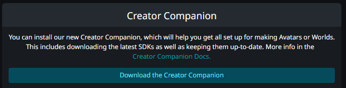

## **2. 必須パッケージの追加**  

- 以下のパッケージをVCC経由で導入します。
  - **必須パッケージ**  
    - [lilToon](https://lilxyzw.github.io/lilToon/)  のウェブページから「VCCに追加」を選択し、画面の案内に従ってAdd Repositoryを行ってください。
    - [FaceEmo](https://suzuryg.github.io/face-emo/ja/)  のウェブページから「ダウンロード(VCC)」を選択し、画面の案内に従ってAdd Repositoryを行ってください。
    - [Modular Avatar](https://modular-avatar.nadena.dev/ja)  のウェブページから「ダウンロード」を選択し、画面の案内に従ってAdd Repositoryを行ってください。

## 3. **VCCで新規プロジェクトの作成**

画面右上のCreate New Projectから新規プロジェクトを作成してください。

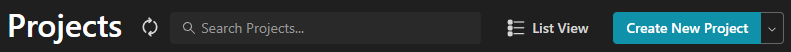

続いて表示される画面でUnity2022 Avatar Projectを選択し、プロジェクト名を任意に設定してCreate Projectからプロジェクトを作成してください。

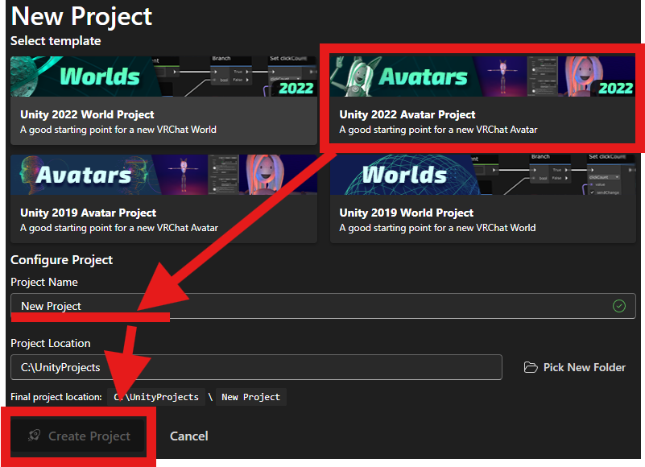

## 4. 必須パッケージのインストール

プロジェクトが作成できたらまずManage Projectを選択します。

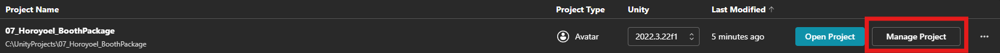

ここでlilToon, Modular Avatar, FaceEmoをインストールしてください。Not Installedのプルダウンメニューから最新版を選択するか、右端の(＋)を選択してインストールできます。

ここで必須パッケージが表示されない場合は、[2. 必須パッケージの追加](###_2-必須パッケージの追加)をやり直してください。

最終的に以下のようにlilToon, Modular Avatar, FaceEmoがインストールされた状態になればOKです。

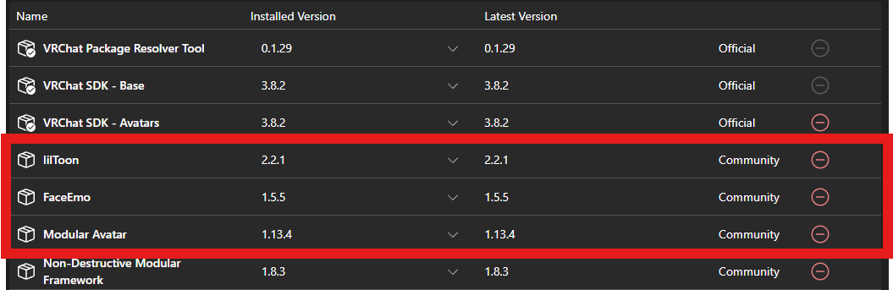

## 5. **ホロヨエル本体のインポート**  

- Open Projectを選択し、作成したプロジェクトを開いてください。Unityが起動します。

- Unity のメニューから **Assets → Import Package → Custom Package** を選択。  

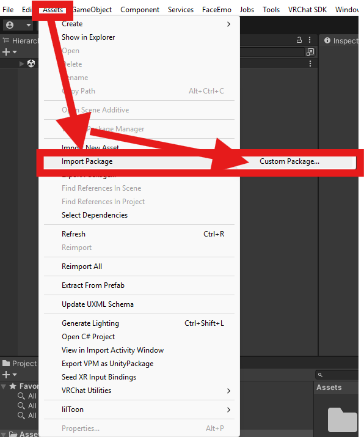

- 配布ファイル **`HoroyoelVerXXX.unitypackage`** を指定してインポートしてください。（xxxにはバージョン名が入ります）。

  Importを選択し、インポートします。

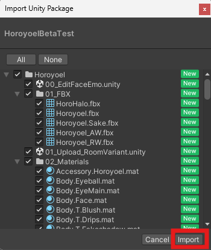

- インポートが完了すると `Horoyoel` フォルダがアセットに追加されます。

## 6. **シーンに配置**  

- 以下のいずれかの Prefabを **Hierarchy** にドラッグ＆ドロップしてください。  
  - Assets/Horoyoel/Horoyoel_PresetA  (天使の服を着たホロヨエル)
  
  - Assets/Horoyoel/Horoyoel_PresetR  (ルームウェアを着たホロヨエル)
  
    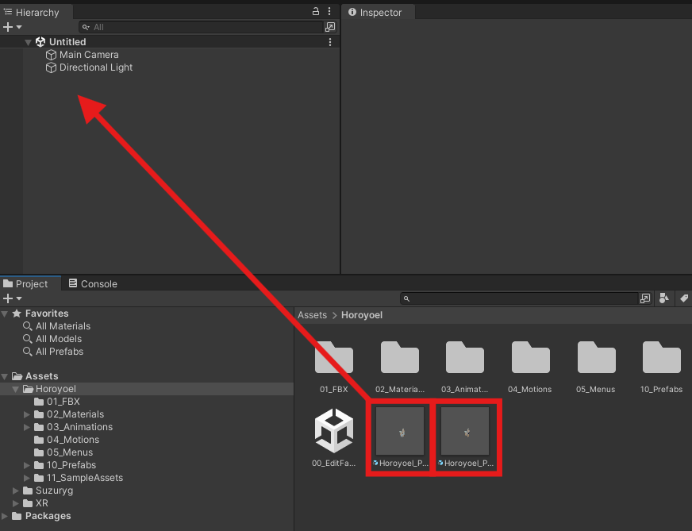
  
    成功するとホロヨエルがシーンに置かれます。
  
    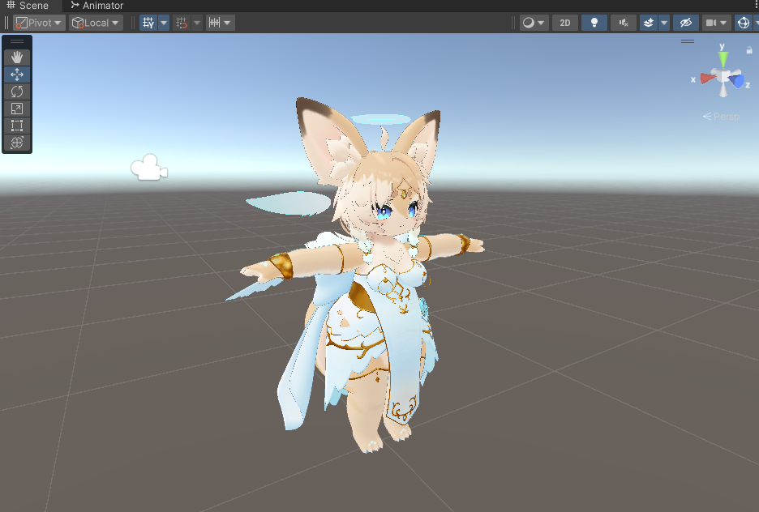

## 7. **アップロード**  

- Unity のメニューからVRChat SDK -> Show Control Panel で VRChat SDK の Control Panel を開き、VRChatのIDでログインしてください。

  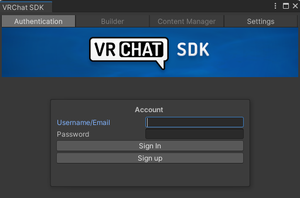

- ログインするとBuilderタブからAvatarの情報を入力できるようになります。Name, Visibility, サムネイルを設定してアップロードします。

> ⚠️ 注意  
> Visibility の項目は 必ず Private に設定してください。  
> Public に設定するのは 規約違反 です！

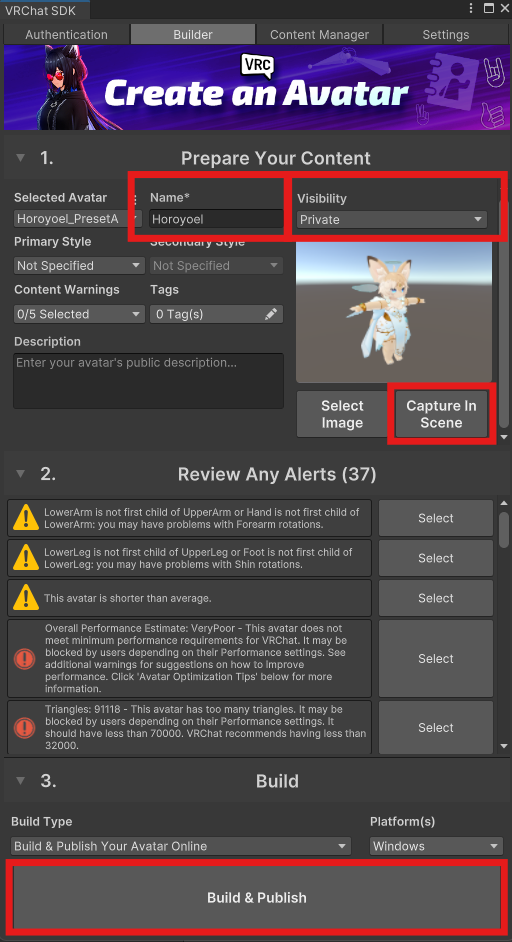

- → Build から **Build & Publish**を実行。  

- アップロードを完了させます。お疲れ様でした！