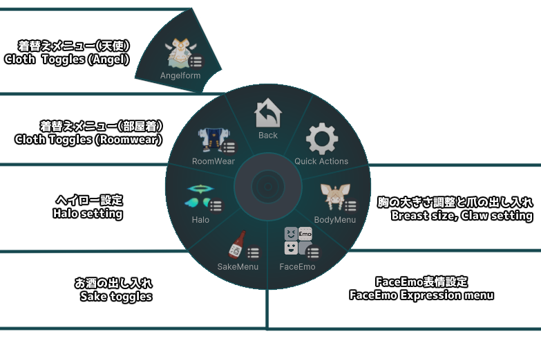
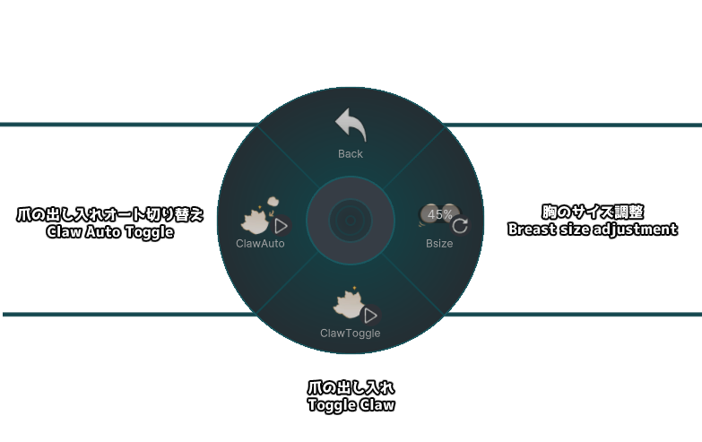
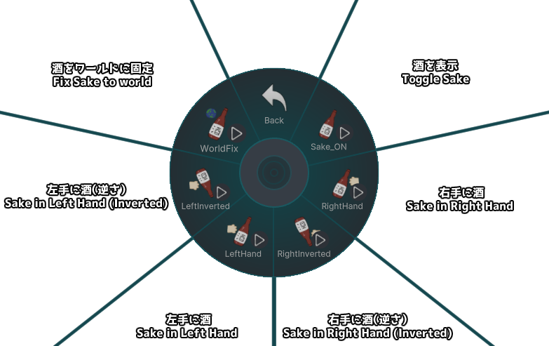
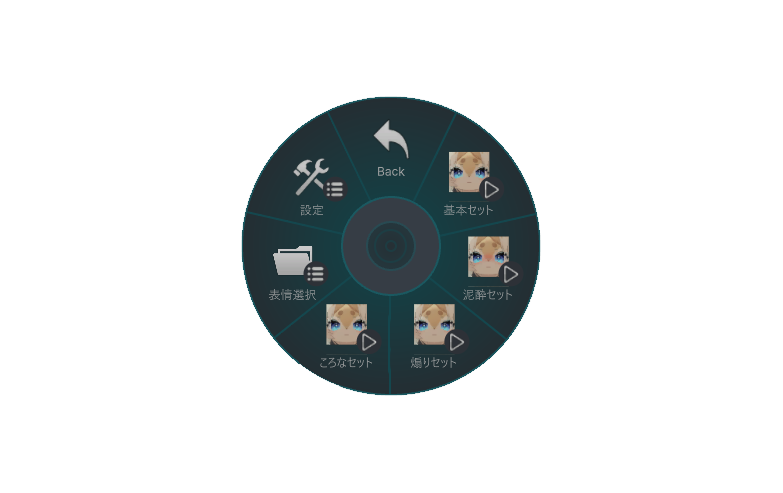

# 基本操作

この章では、ホロヨエルの表情や身体ギミックなど、主なインタラクション操作について解説します。

---

## Expression Menu（表情・ギミック操作）

ホロヨエルのメニューは以下の用になっています。以下順番に解説します。

---

## BodyMenu

BodyMenuでは以下の項目を設定できます：

- **Bsize**：胸のサイズ調整。デフォルトは45%。  
- **ClawToggle**：爪を出し入れします。
- **ClawAuto**：ONの間、両手を顔の前に構えて Fist -> Openとジェスチャーすることによりメニューを開かずに爪の出し入れができます。  

---

## SakeMenu

SakeMenuではお酒のボトルの出し入れができます。

酒は一定以上傾けると中身がこぼれます。

**ここに酒をこぼしているいい感じの画像**

------

## Halo setting, Cloth Toggle menu

---

## FaceEmo（表情セット切り替え）

FaceEmoでは以下の4種類の表情セットから1つを選んで使用できます：

|  |
| :-------------------------------------: |
|  |
|  |
|  |

---

## FaceEmo の操作方法について

FaceEmoの基本操作については、以下の公式ドキュメントをご参照ください：

👉 [FaceEmo 操作ガイド（Setting Menu）](https://suzuryg.github.io/face-emo/ja/docs/optional-functions/setting-menu/)

※ ダンスギミックの使用方法についても上記ページ内で解説されています。

※ 既知の不具合として、ダンスギミック中にBody AdjustギミックのBreast Sizeが正常に動作しないことを確認しています。Breast Size変更状態でダンスギミックを使う場合は後述の改変ガイドを参考にデフォルト体型を変更してください。